# Order Management for AI Futures Trading Signals

## Project Overview

This repository/project studies the execution for AI futures trading agent across seven asset classes.

The AI agent already gives target positions every five minutes. The project does not retrain the agent, change the agent signal, or change the desired position path. The question is whether the same required trades can be executed at better prices than immediate execution.

The benchmark PnL assumes that every position change is filled immediately at the observed market price (post data cleansing). The final strategy replaces that immediate fill with a conditional filling probability limit-order rule. The strategy chooses how far away to place the limit order based on historical fill probability.

**Main code path:**

```text
raw_data/
   ↓
scripts/clean_data.py
   ↓
data_2/agent_right/ and data_2/futures_right/
   ↓
scripts/trading.py
   ↓
data_2/result/{market}/
```

The final strategy is implemented in:

```text
src/trade/regime_fixed_rule.py
```

The final all-market backtest is run from:

```text
scripts/trading.py
```

## Term Project Question:

Given the agent's desired position changes, can order management be improved to execute those same trades at better prices than immediate market execution?

Thus the project is about execution, not any prediction. The agent determines the trade direction and trade size. The order management strategy only determines the execution price and does not assume partial fills.

## Repository Structure

```text
order_management/
│
├── raw_data/
│   ├── README.md
│   └── Raw futures and AI agent CSV files by market
│
├── data_2/
│   ├── README.md
│   ├── agent/
│   ├── futures/
│   ├── agent_right/
│   ├── futures_right/
│   └── result/
│
├── notebooks/
│   ├── README.md
│   ├── demo1_explore_data.ipynb
│   ├── demo2_clean_data.ipynb
│   ├── demo3_data_display.ipynb
│   ├── demo4_price_pnl.ipynb
│   ├── demo5_tick.ipynb
│   ├── demo6_features.ipynb
│   └── demo7_trading.ipynb
│
├── scripts/
│   ├── README.md
│   ├── clean_data.py
│   └── trading.py
│
├── src/
│   ├── README.md
│   ├── data/
│   ├── trade/
│   └── utils/
│
├── environment.yml
├── requirements.txt
└── README.md
```

## How the Code Is Organized

The repository has three main sections.

### 1. Notebooks

The notebooks are the demo version of the project. They show our logic and rationality, step by step, and explain any assumptions we made or steps we took to get to our final PnL

### 2. Scripts

The runnable pipeline. `clean_data.py` prepares the raw data; `trading.py` runs the final backtest and saves results.
runs the final backtest and saves the results.

### 3. Source Code

Reusable code called by the scripts and notebooks. `src/data/` has cleaning helpers; `src/trade/` has the execution rules including the final `regime_fixed` strategy; `src/utils/` has path definitions and futures month-code mappings.

## Code Walkthrough: `scripts/clean_data.py`

The first script to run is:

```bash
python scripts/clean_data.py
```

This script creates the cleaned datasets used by the trading backtest.

### Inputs

The script starts from the raw market files in:

```text
raw_data/{market}/
```

Each market has futures data and AI agent data.

The futures data contains market OHLCV information:

```text
time, open, high, low, close, volume
```

The AI agent data contains the agent's target position:

```text
date, hour, minute, price, position
```

### Main Cleaning Steps

The cleaning script does five main things.

#### Step 1: Load raw futures and agent files

For each market, the script loads the raw futures contract files and the corresponding AI agent position file.

This matters because each futures market has multiple contracts. The strategy needs a  continuous series that matches the contract the agent appears to be trading.

#### Step 2: Standardize timestamps

The script converts raw date/hour/minute fields into usable timestamps and applies a 6 hour forward shift so that the futures trading session aligns to the same calendar day rather than spanning overnight into the next (see demo1).  Weekends and market breaks are dropped.

#### Step 3: Build continuous futures data

The raw data contains several futures contracts for the same asset. The notebook constructs a continuous futures series so that the trading backtest can use one clean price series per market.

The repo contains multiple contract-selection ideas:

```text
volume rule
agent rule
coverage-ratio idea
```

The final trading analysis uses the agent rule. The agent rule matches the futures contract to the price series that the AI agent appears to be using. This keeps the benchmark and the execution strategy on the same underlying contract.

#### Step 4: Save both one-minute and five-minute data

The project uses both one minute and five minute futures data.

The one minute data is used for feature construction, especially short-horizon volatility and future high-low ranges.

The five minute data is used for the trading loop because the AI agent provides positions every five minutes.

#### Step 5: Write cleaned files

The final cleaned files are saved into:

```text
data_2/agent_right/
data_2/futures_right/
```

These are the main inputs to `scripts/trading.py`.

### Output of `clean_data.py`

After `clean_data.py` runs, the repo should have cleaned files that line up the AI agent positions with the futures price series.

In simple terms:

```text
raw futures contracts + raw AI agent positions
        ↓
clean timestamps and trading sessions
        ↓
select the futures contract using the agent rule
        ↓
create continuous futures series
        ↓
save cleaned files into data_2/agent_right and data_2/futures_right
```

## Code Walkthrough: Notebook Demos

The notebooks explain the same project flow in smaller pieces.

| Notebook | What it does | How it connects to the code |
|---|---|---|
| `demo1_explore_data.ipynb` | Opens the raw futures and agent files and shows what the original data looks like. | This is the starting point before cleaning. |
| `demo2_clean_data.ipynb` | Walks through the cleaning process and saves processed files into `data_2/`. | This mirrors the logic later automated in `scripts/clean_data.py`. |
| `demo3_data_display.ipynb` | Displays the cleaned futures and agent data. | This checks that the cleaned files line up correctly. |
| `demo4_price_pnl.ipynb` | Reconstructs the original AI agent PnL. | This creates the benchmark that the execution strategy is compared against. |
| `demo5_tick.ipynb` | Tests simple tick-based execution ideas. | This is an early step toward choosing a limit-order distance. |
| `demo6_features.ipynb` | Builds volatility and crossover features. | These features become the state variables used by the final strategy. |
| `demo7_trading.ipynb` | Runs and explains the final `regime_fixed` strategy. | This connects directly to `scripts/trading.py` and `src/trade/regime_fixed_rule.py`. |

Especically, `demo6_features.ipynb` studies which state variables best condition the fill probability. The notebook tests three candidates — volume, volatility, and trend (EMA crossover) — and compares their power to separate the fill probability curves. The first two plots below show fill probability curves conditioned jointly on volatility and volume regimes: within the same volatility band, the two volume groups (blue vs. red) produce nearly identical curves, which means volume adds little beyond what volatility already captures. The last two plots condition instead on volatility and trend (9 combinations of 3×3 regimes), showing clear separation — higher volatility (dotted lines) consistently shifts the fill probability curve upward for both buy orders (High) and sell orders (Low). This confirms that volatility and trend are the two state variables used in the final strategy.

| | |
|:---:|:---:|
| **Fill Probability — High (vol × volume)** | **Fill Probability — Low (vol × volume)** |
| 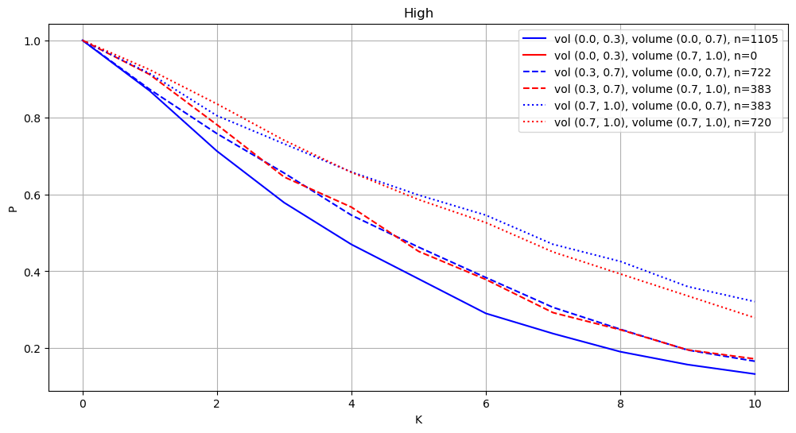 | 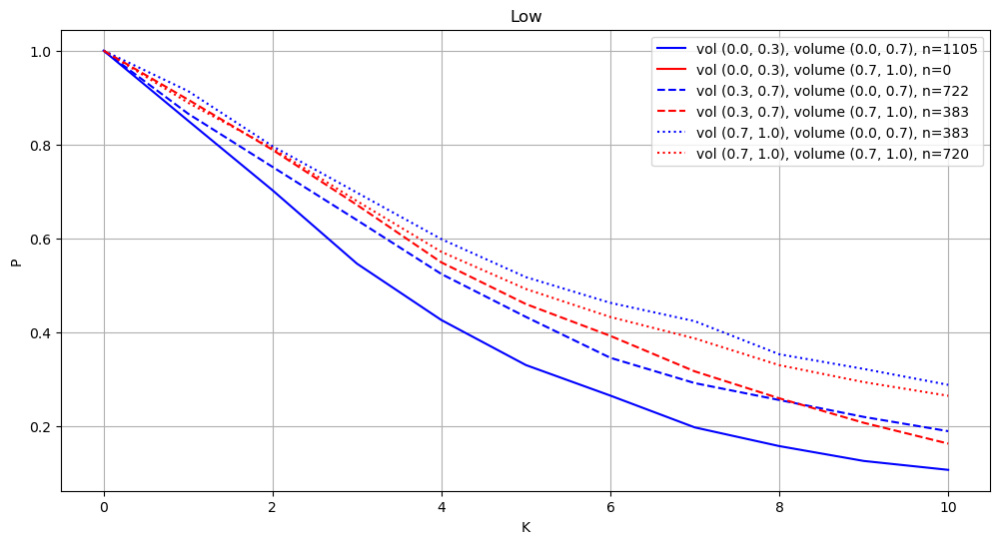 |
| **Fill Probability — High (vol × trend)** | **Fill Probability — Low (vol × trend)** |
| 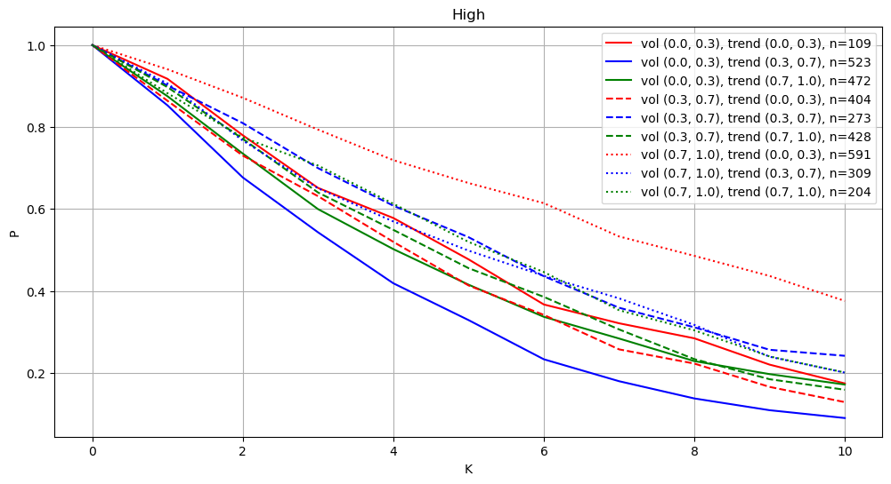 | 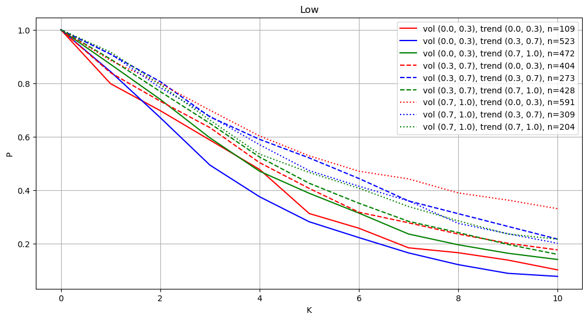 |

The notebooks are useful for presentation because they show the idea gradually. The scripts are useful for rerunning the whole pipeline.

## Code Walkthrough: `scripts/trading.py`

After the data is cleaned, the final backtest is run with:

```bash
python scripts/trading.py
```

This script is the main results file. It loads the cleaned data, runs the final execution strategy, compares it to the agent benchmark, and saves plots and order-level details.

### Inputs

The script uses the cleaned data from:

```text
data_2/agent_right/
data_2/futures_right/
```

The agent data gives the target position every five minutes. The futures data gives the price path used to test whether limit orders would fill.

### Market Loop

The script runs the final strategy separately for each market:

```text
EuroStoxx
GBP - British Pound
German Bunds - German Government Bonds
Gold
HeatingOil
JPY - Japanese Yen
Nasdaq
```

Each market has its own final parameters for the fill-probability threshold and the `tau` window.

| Market | Tau Window | Fill Probability |
|---|---:|---:|
| EuroStoxx | 60 minutes | 0.50 |
| GBP - British Pound | 5 minutes | 0.90 |
| German Bunds - German Government Bonds | 5 minutes | 0.90 |
| Gold | 20 minutes | 0.80 |
| HeatingOil | 60 minutes | 0.50 |
| JPY - Japanese Yen | 5 minutes | 0.90 |
| Nasdaq | 10 minutes | 0.90 |

### Benchmark PnL

The first comparison point is the original AI agent benchmark.

The benchmark assumes that every change in the agent's target position is executed immediately at the current observed price.

If the agent position changes from `q_{t-1}` to `q_t`, then:

```text
delta_q = q_t - q_{t-1}
```

If `delta_q > 0`, the agent buys.  
If `delta_q < 0`, the agent sells.  
If `delta_q = 0`, no trade is needed.

The benchmark PnL is important because the final strategy receives the same position changes. Any improvement comes from execution price and timing, not from a different signal.

### Feature Construction

The trading script builds the state variables used by the final strategy.

The final implementation uses:

```text
ema_volatility
crossover_pct
```

The volatility feature is based on realized volatility from one-minute returns over the current `tau` window.

The crossover feature is based on a short EMA minus a long EMA:

```text
crossover = EMA_short - EMA_long
crossover_pct = crossover / close * 100
```

The state space is built as a grid:

```text
3 volatility regimes × 3 crossover regimes = 9 states
```

The crossover variable is not used as a trend trading rule. It only helps condition the historical fill distribution. The AI agent still decides whether to buy or sell.

### Fill Distribution

For each timestamp, the strategy looks forward over the `tau`-minute window and measures how far the market moved in the favorable direction.

For a buy order:

```text
future_low_move = close_t - future_low
```

For a sell order:

```text
future_high_move = future_high - close_t
```

These historical observations create an empirical distribution of favorable price moves.

The strategy estimates:

```text
P(favorable move >= k * tick_size | current state)
```

for possible values of `k`.

### Choosing the Limit Distance

For each required trade, the strategy chooses the largest `k` that still satisfies the fill-probability threshold.

```text
Choose the largest k such that:

P(favorable move >= k * tick_size | current state) >= fill_prob
```

The maximum allowed distance is:

```text
max_k = 10
```

If the current state does not have enough historical observations, the strategy falls back to the global empirical distribution.

The minimum number of observations required for a state-specific distribution is:

```text
min_obs_per_regime = 25
```

### Execution Simulation

Once `k` is chosen, the strategy fixes the target price.

For a buy order:

```text
target_price = close - k * tick_size
```

For a sell order:

```text
target_price = close + k * tick_size
```

The target does not reset every five minutes. It stays fixed until the order fills or is forced to close.

The script records three execution states.

| Execution State | Meaning |
|---|---|
| `successful` | The order fills during the first `tau`-minute window. |
| `delayed_execution` | The order misses the first window but fills later at the original target price. |
| `forced_close` | The order never fills and is executed at the final close. |

For a buy order, the order fills if:

```text
low <= target_price
```

For a sell order, the order fills if:

```text
high >= target_price
```

This is a bar-data fill assumption. It is useful for the project, but it is not the same as an order-book simulator.

### Output Files

For each market, `trading.py` saves results into:

```text
data_2/result/{market}/
```

Each result folder contains:

```text
pnl.png
position.png
trading_detail.pkl
```

The PnL plot compares:

```text
agent original pnl
strategy pnl
strategy - agent
```

The position plot compares:

```text
agent target position
strategy executed position
```

The detailed order file contains fields such as:

```text
signal_time
exec_time
side
qty
delta_q
ref_price
target_price
exec_price
k
fill_prob_estimate
state_key
ema_volatility
crossover_pct
execution_state
delay_5m_bars
delay_tau_intervals
```

In simple terms, `trading.py` does this:

```text
load cleaned market data
        ↓
calculate agent benchmark PnL
        ↓
build volatility and crossover states
        ↓
estimate conditional filling probabilities
        ↓
choose limit-order distance k
        ↓
simulate order execution
        ↓
compare strategy PnL to agent PnL
        ↓
save plots and order-level details
```

## Code Walkthrough: `src/trade/regime_fixed_rule.py`

This file contains the final execution strategy.

The key idea is fixed-target conditional execution.

The strategy receives a required trade from the AI agent. It does not decide the direction. It only decides the target limit price.

The main logic is:

```text
1. Read the current market state.
2. Estimate historical fill probabilities for different k values.
3. Choose the largest k that satisfies the fill-probability threshold.
4. Create a fixed target price.
5. Check whether future high/low bars reach that target.
6. Record the execution state and execution price.
```

The important point is that this file implements an execution rule, not a new alpha signal.

## Code Walkthrough: `src/data/data.py`

This file contains reusable data-cleaning functions.

The scripts and notebooks use this code so that the same cleaning logic does not have to be rewritten in every notebook.

Conceptually, this file supports:

```text
loading raw futures and agent files
cleaning timestamps
filtering trading periods
stitching futures contracts
saving cleaned files
```

## Code Walkthrough: `src/trade/intuition_rule.py`

This file contains earlier execution ideas that were tested before the final strategy.

These rules are useful for understanding development, but they are not the source of the final reported results.

The final reported results come from the conditional filling-probability method in `regime_fixed_rule.py`.

## Code Walkthrough: `src/utils/`

The `src/utils/` folder stores helper code used across the project.

```text
src/utils/paths.py
```

stores the project path definitions so that scripts can find the raw data, cleaned data, and result folders.

```text
src/utils/month_codes.py
```

stores futures month-code mappings. This is useful because futures contract names usually include a month code, and the code needs to interpret those contract identifiers correctly.

## How to Run the Project

From the project root, create and activate the environment.

Using `venv` on Windows:

```powershell
python -m venv .venv
.venv\Scripts\activate
python -m pip install --upgrade pip
pip install -r requirements.txt
pip install pyarrow fastparquet
```

Or using conda:

```bash
conda env create -f environment.yml
conda activate <environment-name>
```

Then run the pipeline:

```bash
python scripts/clean_data.py
python scripts/trading.py
```

The first command cleans the raw data. The second command runs the final trading backtest.

## Final Results

The final strategy improves aggregate PnL, but the improvement is market-specific.

| Market | Agent PnL | Strategy PnL | Difference | Improvement |
|---|---:|---:|---:|---:|
| EuroStoxx | 1,219.50 | 2,052.00 | 832.50 | 68.27% |
| GBP - British Pound | 92.36 | 73.12 | -19.24 | -20.83% |
| German Bunds - German Government Bonds | -10.48 | -10.48 | 0.00 | 0.00% |
| Gold | 1,882.00 | 2,163.30 | 281.30 | 14.95% |
| HeatingOil | 966.82 | 1,314.51 | 347.69 | 35.96% |
| JPY - Japanese Yen | 6.94 | 6.86 | -0.08 | -1.08% |
| Nasdaq | 28,950.25 | 33,584.00 | 4,633.75 | 16.01% |
| **Total** | **33,107.39** | **39,183.31** | **6,075.93** | **18.35%** |

| | |
|:---:|:---:|
| **EuroStoxx** | **GBP - British Pound** |
| 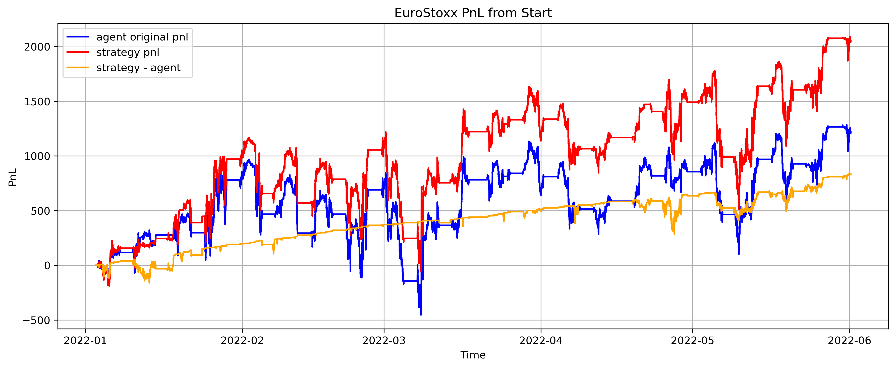 |  |
| **German Bunds** | **Gold** |
|  | 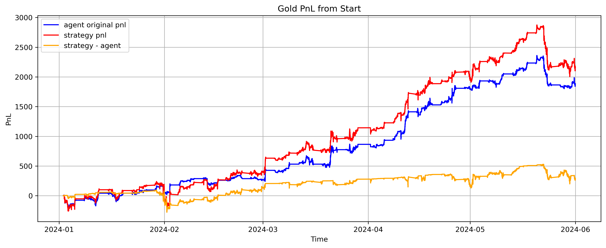 |
| **HeatingOil** | **JPY - Japanese Yen** |
| 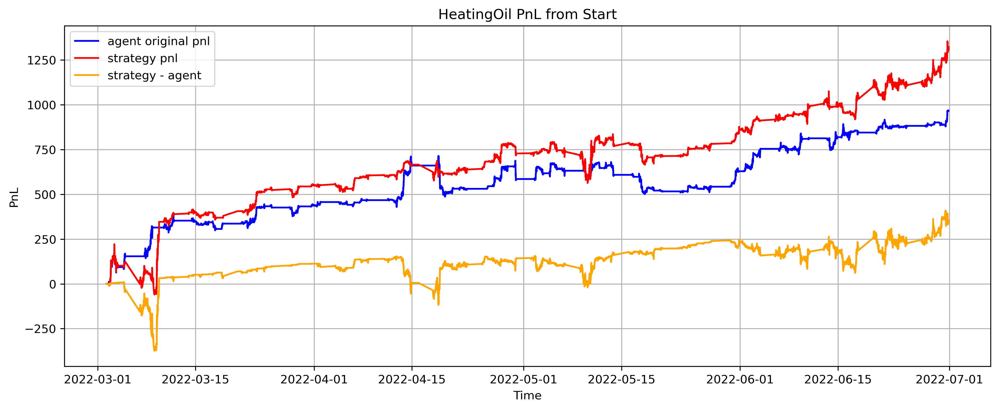 |  |
| **Nasdaq** | |
| 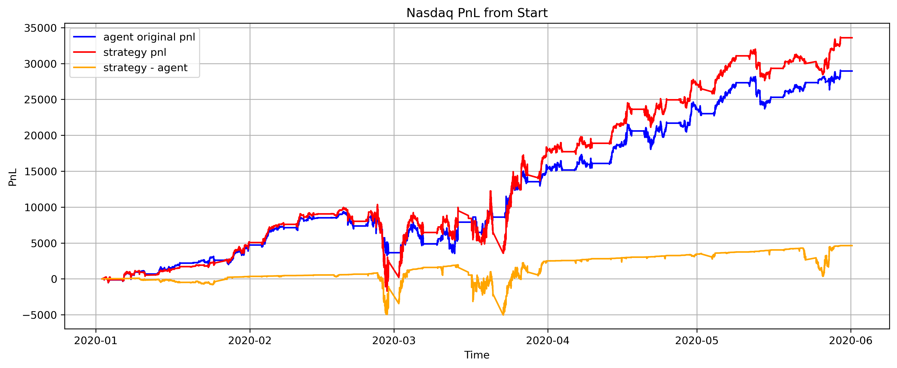 | |


The largest percentage improvement is EuroStoxx. The largest absolute improvement is Nasdaq.

The weaker markets are also important. GBP and JPY underperform the benchmark, and German Bunds is unchanged. This shows that the method is not a universal trading rule. It works only when the market's historical range behavior supports passive limit orders at the required fill-probability threshold.

## Execution Summary

| Market | Trades | Successful | Delayed | Forced Close | Mean k |
|---|---:|---:|---:|---:|---:|
| EuroStoxx | 212 | 169 | 43 | 0 | 10.00 |
| GBP - British Pound | 449 | 422 | 17 | 10 | 0.00 |
| German Bunds - German Government Bonds | 613 | 595 | 18 | 0 | 0.00 |
| Gold | 1,276 | 1,138 | 134 | 4 | 1.00 |
| HeatingOil | 290 | 167 | 88 | 35 | 3.90 |
| JPY - Japanese Yen | 762 | 734 | 22 | 6 | 0.00 |
| Nasdaq | 2,164 | 2,042 | 122 | 0 | 2.42 |

| | |
|:---:|:---:|
| **EuroStoxx** | **GBP - British Pound** |
| 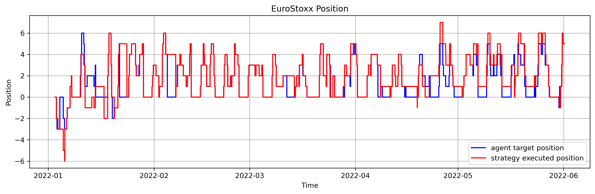 |  |
| **German Bunds** | **Gold** |
|  | 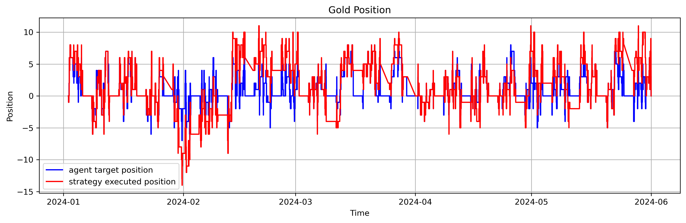 |
| **HeatingOil** | **JPY - Japanese Yen** |
| 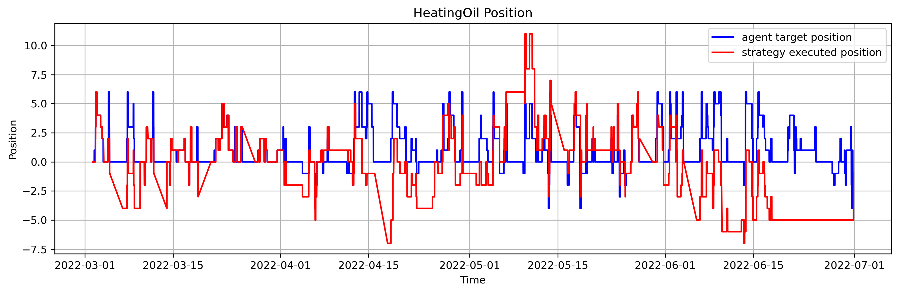 |  |
| **Nasdaq** | |
| 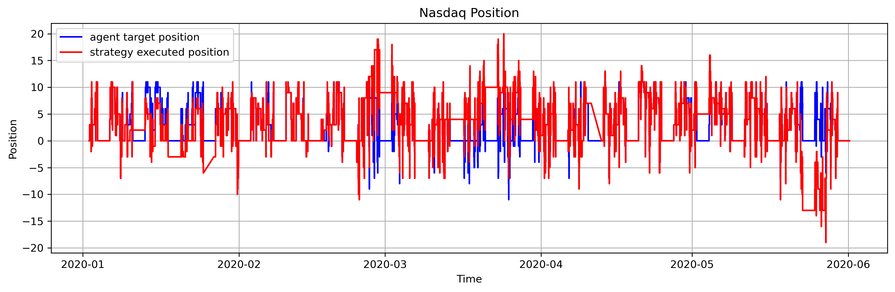 | |

Nasdaq performs well because it has many trades, positive average order depth, and no forced closes.

Gold improves through small but consistent execution improvement across many trades.

HeatingOil improves, but it also has the most forced closes. This shows stale-order risk.

GBP, JPY, and German Bunds mostly choose `k = 0`, which means the empirical filling distribution does not support deeper passive orders under the selected thresholds.

## How to Present the Code

A clean presentation order is:

```text
1. Show raw_data/ to explain the input files.
2. Open scripts/clean_data.py to explain how the cleaned files are created.
3. Open data_2/agent_right and data_2/futures_right to show the cleaned outputs.
4. Open demo4_price_pnl.ipynb to explain the original agent benchmark.
5. Open demo6_features.ipynb to explain volatility and crossover states.
6. Open demo7_trading.ipynb to explain the final strategy.
7. Open scripts/trading.py to show the all-market backtest runner.
8. Open data_2/result/{market}/ to show pnl.png, position.png, and trading_detail.pkl.
```

The main explanation should be:

```text
clean_data.py prepares the data.
trading.py runs the final strategy.
regime_fixed_rule.py contains the execution rule.
the notebooks explain the same workflow step by step.
```

## Interpretation

This project should be interpreted as an execution study.

The final question is:

```text
Can conditional filling probabilities improve execution of an existing AI agent's trades?
```

The final question is not:

```text
Can volatility and trend predict market direction?
```

The strategy does not change the AI agent's position path. It only changes the execution method used to fill the same required trades.

## Limitations

The backtest has several important limitations.

First, the strategy assumes that a limit order fills whenever the high or low reaches the target price. In real markets, a price touch does not guarantee a fill because queue position and order-book depth matter.

Second, the strategy does not model partial fills.

Third, the strategy allows orders to remain active after the first `tau` window. This creates stale-order risk because the AI agent's desired position may change before the old order fills.

Fourth, the same simplified tick size is used across markets. A production version should use contract-specific tick sizes and tick values.

Fifth, transaction costs, bid-ask spreads, and market impact are not fully modeled.

Finally, the results are market-specific. Nasdaq, EuroStoxx, HeatingOil, and Gold improve, but British Pound and Japanese Yen do not. German Bunds is unchanged. Therefore, the final rule should be viewed as a conditional execution framework rather than a universal trading strategy.
